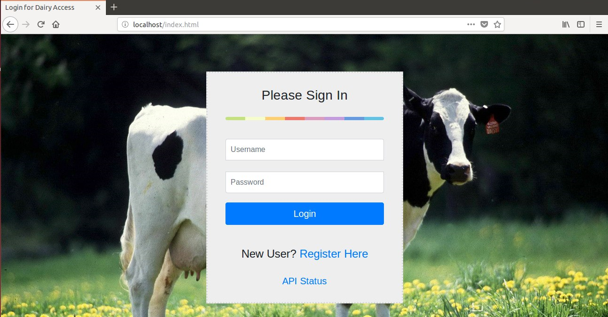
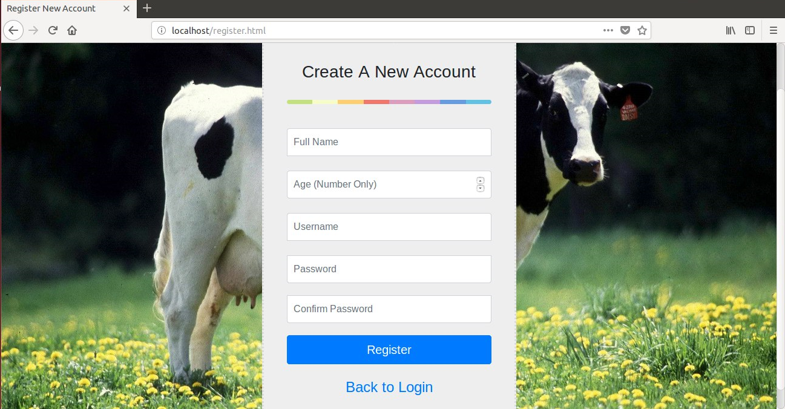
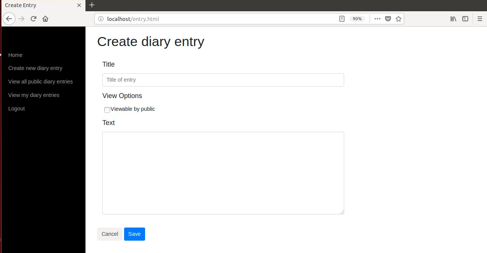
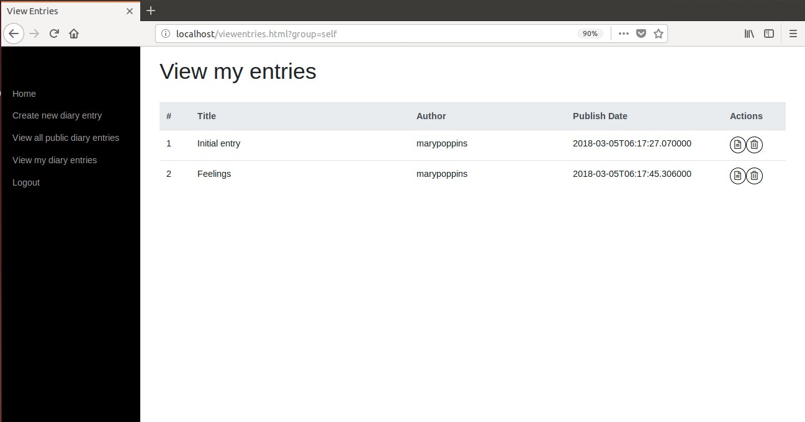
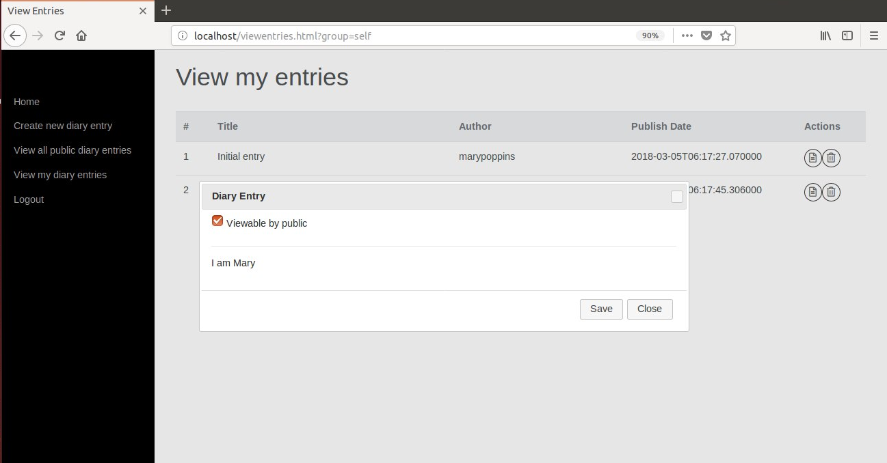
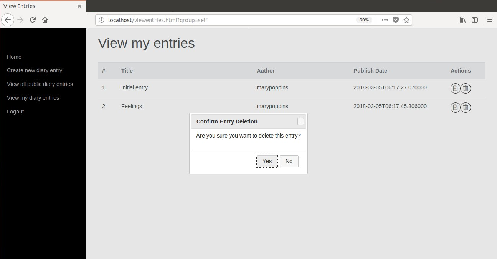

# rest-api-development

CS5331 Assignment 1 Project Reference Repository

## Instructions

Your objective is to implement a web application that provides the endpoints
specified here: https://cs5331-assignments.github.io/rest-api-development/.

The project has been packaged in an easy to set-up docker container with the
skeleton code implemented in Python Flask. You are not restricted in terms of
which language, web stack, or database you desire to use. However, please note
that very limited support can be given to those who decide to veer off the
beaten path.

You may be required to modify the following files/directories:

- Dockerfile - contains the environment setup scripts to ensure a homogenous
  development environment
- src/ - contains the front-end code in `html` and the skeleton Flask API code
  in `service`
- img/ - contains images used for this README

Assuming you're developing on an Ubuntu 16.04 machine, the quick instructions
to get up and running are:

```
# Install Docker

sudo apt-get update
sudo apt-get install \
    apt-transport-https \
    ca-certificates \
    curl \
    software-properties-common
curl -fsSL https://download.docker.com/linux/ubuntu/gpg | sudo apt-key add -
sudo add-apt-repository \
   "deb [arch=amd64] https://download.docker.com/linux/ubuntu \
   $(lsb_release -cs) \
   stable"
sudo apt-get update
sudo apt-get install docker-ce

# Verify Docker Works

sudo docker run hello-world

# Run the skeleton implementation

sudo ./run.sh
```

(Docker CE installation instructions are from this
[link](https://docs.docker.com/install/linux/docker-ce/ubuntu/#install-using-the-repository).)

**Please consult your assignment hand-out for detailed setup information.**

## Grading

The implementation will be graded in an automated fashion on an Ubuntu 16.04
virtual machine by building the docker container found in your repository and
running it. The grading script will interact with your API.

The following ports are expected to be accessible:

1. 80, on which static HTML content, including the front-end, is served.
2. 8080, on which the API is exposed.

To verify this, please run the following commands:

```
sudo ./run.sh
```

On a different window:

```
curl http://localhost:80
curl  http://localhost:8080
```

If a response is received, you're good to go.

**Please replace the details below with information relevant to your team.**

## Screenshots

Login Page



Register User



Create Diary Entry



View Public Entries


View My Personal Entries



View Diary Entry Details and Modify Permissions



Delete Entry



## Administration and Evaluation

Please fill out this section with details relevant to your team.

### Team Members

1. Ngo Kim Phu
2. Choo Rui Bin
3. Ouyang Danwen
4. Chai Wai Aik Zander

### Short Answer Questions

#### Question 1: Briefly describe the web technology stack used in your implementation.

The web framework is written in Python Flask that connects to a MongoDB database and the web server is hosted on Apache. The frontend is designed using HTML, Bootstrap CSS and JavaScript (jQuery).

#### Question 2: Are there any security considerations your team thought about?

We have identified these security issues, however it had been stated in the assignment brief that there is no need to implement the actual security measures to counter these issues.
- Cookie management
- Replay attacks
- XSS and CSRF attacks
- Timing attacks
- Ensuring that private diary entries cannot be viewed by the public

#### Question 3: Are there any improvements you would make to the API specification to improve the security of the web application?


#### Question 4: Are there any additional features you would like to highlight?

The generated cookie has an expiry time of 2 hours to reduce the possibility of replay attacks.

#### Question 5: Is your web application vulnerable? If yes, how and why? If not, what measures did you take to secure it?

One potential weakness is in the cookie management - currently we are still using the default JavaScript cookie functions. A better implementation would be to use JWT, however it was assured that we would not have to do its implementation in this current assignment.

#### Feedback: Is there any other feedback you would like to give?

### Declaration

#### Please declare your individual contributions to the assignment:

1. Ngo Kim Phu
  - Wrote the back-end code
  - Designed the Docker configuration
2. Choo Rui Bin
  - Wrote the front-end code
  - Integrated the RESTful API into the front-end
3. Ouyang Danwen
  - Designed the database schema
  - Wrote the back-end code
4. Chai Wai Aik Zander
  - Wrote the front-end code
  - Integrated the RESTful API into the front-end